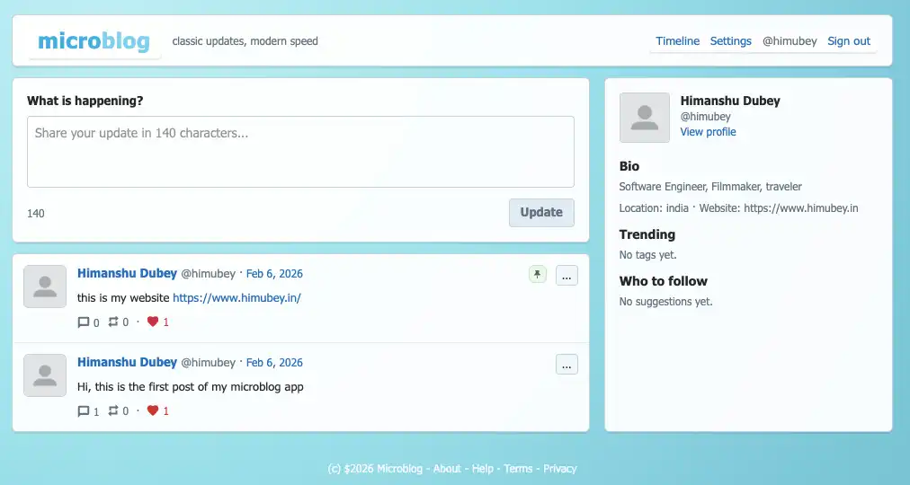

# Microblog

A lightweight retro microblogging app inspired by the 2007–2011 era, built with Astro + Supabase.



**Made by:** Himanshu Dubey  
**Website:** https://himubey.in

## Features
- Email/password auth (Supabase)
- Public timeline + profile pages
- Replies, likes, reposts, quotes
- Hashtags + trending tags
- Pin post to profile
- Clean retro UI (fast + SEO‑friendly)

## Tech Stack
- Astro (SSR)
- Supabase (Postgres + Auth + RLS)
- Tailwind CSS
- Vercel (deployment)

## Local Setup
1. Install dependencies:
   ```bash
   npm install
   ```
2. Create a `.env` file with:
   ```
   SUPABASE_URL=...
   SUPABASE_ANON_KEY=...
   ```
3. Run dev server:
   ```bash
   npm run dev
   ```

## License
Apache-2.0. See `LICENSE` and `NOTICE`.
